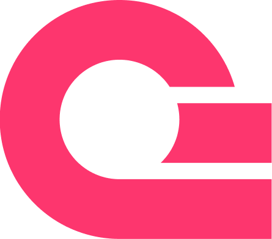
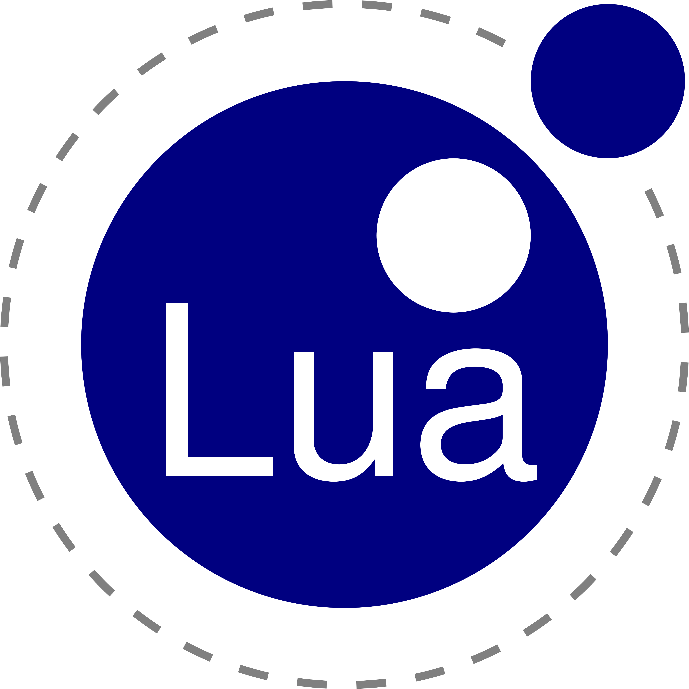

   

  
   

 

  
My projects list

  
  
  | My projects list | 
  | :--:  | 
  | _[**TechOne UI**](https://techoneui.vercel.app/) - Open-source design framework for create applications, based on web-technologies._ | 
  | _[**Spark Studio**](https://github.com/ll1ness/spark-studio) - Open-source project for create simple desktop applications on JavaFX, JPHP, based on [DevelNext](http://develnext.org/)._ |
  |_[**Weather Seeker**](https://weather-seeker.vercel.app/) - Open-source powerful web-application for see current weather status._|
  

   

### Soft skills
🎨 Good at being creative with code. This means that I creatively come up with a system for the algorithm of the code, its competent writing and other things. You can check this by reviewing the program sources from the repository, where in README.md The 'Solo Development' widget is marked.

👥 Work well in a team. This means that I am able to express my thoughts competently and negotiate with the development participants.

📚 He is well adapted to learning and development, proactive, able to adapt to almost any field, persistent - constantly looking for new technologies for his code in order to "wind it up".

### Hard skills
👅 Know enough programming languages.   

💾 Also know data algorithms and their structures, which helps me write code efficiently and create effective solutions for the code and the project as a whole.

🤖 Programming with AI and sometimes programming manually, and don't see nothing bad in programming with AI.

🔨 And, of course, the ability to work with different tools and learn them quickly.

#### My coding stack
|  |  |  |  |  |  |  |  |  |  |  |
|-|-|-|-|-|-|-|-|-|-|-|
|  |  |  |  |  |  |  |  |  |  |  |  

---

#### Support me on [Donation Alerts](https://dalink.to/ll1ness)

 
###### Thanks for visiting my profile <3 

[ll1ness Copyright Infringement Takedown Policy and Instructions](dmca.md)
